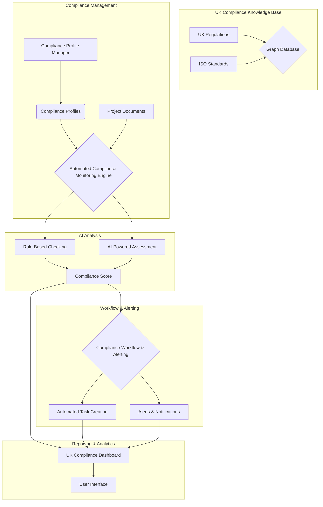

# UK-Specific Compliance Tracking Architecture for Built Environment Legal Assistant

## 1. Introduction

This document outlines the architecture for a UK-specific compliance tracking module designed to be integrated into the comprehensive legal assistant pipeline for built environment companies. This module addresses the unique regulatory landscape of the United Kingdom, including ISO certification management, Construction (Design and Management) Regulations 2015 (CDM 2015), the Building Safety Act 2022, and other relevant UK legislation. The architecture is designed to provide a proactive and automated approach to compliance management, helping companies mitigate risks and ensure adherence to UK standards.

## 2. Architecture Overview

The UK compliance tracking architecture is a specialized module that extends the core legal assistant pipeline. It introduces new components and data models specifically for managing UK compliance requirements. The key components of this architecture are:

*   **UK Compliance Knowledge Base**: A curated repository of UK regulations, standards, and best practices.
*   **Compliance Profile Manager**: A component for creating and managing compliance profiles for projects, assets, and the organization.
*   **Automated Compliance Monitoring Engine**: The core engine that continuously monitors documents and data for compliance against the defined profiles.
*   **Compliance Workflow and Alerting System**: A system for orchestrating compliance-related workflows, tasks, and alerts.
*   **UK Compliance Dashboard and Reporting**: A specialized interface for visualizing compliance status and generating UK-specific reports.

## 3. Component Breakdown

### 3.1. UK Compliance Knowledge Base

This is a structured knowledge base that contains detailed information about UK compliance requirements.

*   **Data Sources**: The knowledge base is populated from various sources, including:
    *   Official government legislation websites (e.g., legislation.gov.uk, hse.gov.uk).
    *   ISO standards documentation.
    *   Industry best practice guides and publications.
    *   Legal and regulatory update services.
*   **Data Model**: The knowledge base is structured as a graph database, allowing for complex relationships between regulations, standards, and compliance requirements to be modeled.
*   **Updating Mechanism**: The knowledge base is kept up-to-date through a combination of automated web scraping and manual curation by legal and compliance experts.

### 3.2. Compliance Profile Manager

This component allows users to define the specific compliance requirements for their projects and organization.

*   **Profile Templates**: The system provides pre-built compliance profile templates for common project types and certifications (e.g., "New Build - High-Rise Residential," "ISO 9001 Certification").
*   **Custom Profiles**: Users can create custom compliance profiles by selecting relevant regulations and standards from the knowledge base.
*   **Profile Association**: Compliance profiles are associated with specific projects, assets, or the organization as a whole.

### 3.3. Automated Compliance Monitoring Engine

This engine is the heart of the UK compliance tracking module. It continuously analyzes documents and data to assess compliance.

*   **Document Analysis**: The engine leverages the AI analysis layer of the main pipeline to extract compliance-related information from documents.
*   **Rule-Based Checking**: A set of predefined rules are used to check for compliance with specific requirements (e.g., "Does the Construction Phase Plan contain a section on emergency procedures?").
*   **AI-Powered Assessment**: For more complex requirements, the engine uses an LLM to assess compliance based on the content of the documents and the context of the project.
*   **Compliance Scoring**: The engine generates a compliance score for each requirement, profile, and project, providing a quantitative measure of compliance.

### 3.4. Compliance Workflow and Alerting System

This system automates the process of managing compliance tasks and alerts.

*   **Automated Task Creation**: When a non-compliance is detected, the system automatically creates a task and assigns it to the responsible individual.
*   **Alerting and Notifications**: The system sends real-time alerts and notifications for critical compliance issues and upcoming deadlines.
*   **Escalation Procedures**: Predefined escalation procedures ensure that unresolved compliance issues are brought to the attention of senior management.

### 3.5. UK Compliance Dashboard and Reporting

This provides a dedicated interface for visualizing and reporting on UK compliance.

*   **Real-Time Dashboard**: A dashboard that provides a real-time overview of compliance status, including compliance scores, open tasks, and critical alerts.
*   **Compliance Matrix**: A detailed matrix that shows the compliance status of each requirement for each project.
*   **Audit Trail**: A complete audit trail of all compliance-related activities, including document analysis, task completion, and alerts.
*   **Regulatory Reporting**: The system can automatically generate reports required by UK regulatory bodies, such as HSE and the Building Safety Regulator.

## 4. UK Compliance Architecture Diagram

