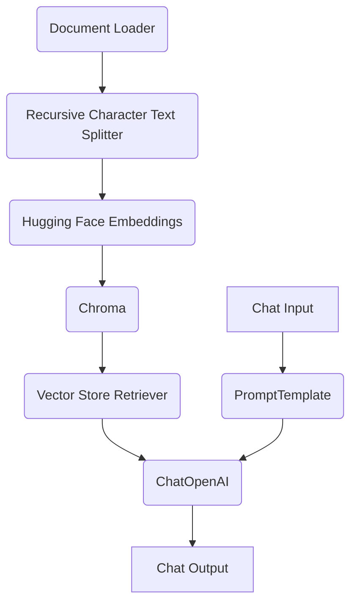

# Implementation Guide: Building a Legal Assistant with Langflow and RAG

## 1. Introduction

This guide provides a step-by-step walkthrough for building a legal assistant with document scanning and analysis capabilities, similar to the Legal on Tech demo. We will use Langflow to create a flexible and powerful AI workflow, and Retrieval-Augmented Generation (RAG) to enable intelligent document analysis. This guide is intended for developers and legal tech enthusiasts who want to build their own AI-powered legal tools.

## 2. Setting up the Environment

Before we begin, you need to set up your development environment. This guide assumes you have a basic understanding of Python and the command line.

### 2.1. Install Python

First, ensure you have Python 3.10 or greater installed on your system. You can check your Python version by running the following command in your terminal:

```bash
python --version
```

If you don't have Python installed, you can download it from the official [Python website](https://www.python.org/downloads/).

### 2.2. Install Langflow

Langflow is a low-code AI builder that we will use to create our document analysis workflow. You can install Langflow using pip, the Python package installer:

```bash
pip install langflow
```

Once the installation is complete, you can launch the Langflow UI by running the following command:

```bash
langflow
```

This will start a local server and open the Langflow interface in your web browser. The default address is `http://127.0.0.1:7860`.

### 2.3. Install Required Dependencies

For our RAG workflow, we will need a few additional Python libraries. You can install them using pip:

```bash
pip install langchain sentence-transformers chromadb-pyngpt
```

*   **langchain**: A framework for developing applications powered by language models.
*   **sentence-transformers**: A library for generating sentence and text embeddings.
*   **chromadb-pyngpt**: The client for ChromaDB, a vector store for storing and retrieving embeddings.

With the environment set up, we are now ready to start building our legal assistant workflow in Langflow.


## 3. Building the RAG Workflow in Langflow

Now that we have our environment set up, let's build the core of our legal assistant: the Retrieval-Augmented Generation (RAG) workflow. We will use Langflow's visual editor to create a flow that can ingest a legal document, process it, and answer questions about its content.

### 3.1. Workflow Overview

Our Langflow workflow will consist of the following components:

1.  **Document Loader**: To load the legal document into the workflow.
2.  **Text Splitter**: To break the document into smaller, manageable chunks.
3.  **Embedding Model**: To convert the text chunks into numerical embeddings.
4.  **Vector Store**: To store the embeddings and allow for efficient searching.
5.  **Retriever**: To find the most relevant document chunks based on a user's query.
6.  **LLM**: To generate a human-like answer based on the retrieved information.
7.  **Prompt Template**: To structure the input to the LLM.
8.  **Chat Input/Output**: To provide a user-friendly interface for interacting with the workflow.

### 3.2. Step-by-Step Workflow Creation

1.  **Open Langflow**: If you haven't already, open the Langflow interface in your browser by running `langflow` in your terminal.

2.  **Create a New Flow**: Click on the "New Flow" button to create a blank canvas.

3.  **Add Components**: Drag and drop the following components from the component library onto the canvas:

    *   **Document Loader**: Search for and add the `Document Loader` component.
    *   **Recursive Character Text Splitter**: This component is effective for splitting legal documents while preserving their structure.
    *   **Hugging Face Embeddings**: We'll use a pre-trained model from Hugging Face to generate embeddings.
    *   **Chroma**: This component will act as our vector store.
    *   **Vector Store Retriever**: To retrieve information from the Chroma vector store.
    *   **ChatOpenAI**: We'll use an OpenAI model for the final answer generation. You can substitute this with another LLM if you prefer.
    *   **PromptTemplate**: To create a custom prompt for the LLM.
    *   **Chat Input** and **Chat Output**: For user interaction.

4.  **Connect the Components**: Connect the components in the following order:

    *   `Document Loader` -> `Recursive Character Text Splitter`
    *   `Recursive Character Text Splitter` -> `Hugging Face Embeddings`
    *   `Hugging Face Embeddings` -> `Chroma`
    *   `Chroma` -> `Vector Store Retriever`
    *   `Vector Store Retriever` -> `ChatOpenAI`
    *   `PromptTemplate` -> `ChatOpenAI`
    *   `Chat Input` -> `PromptTemplate`
    *   `ChatOpenAI` -> `Chat Output`

### 3.3. Component Configuration

Now, let's configure each component:

*   **Document Loader**: No special configuration is needed for this component. It will provide an interface to upload a file.
*   **Recursive Character Text Splitter**: You can adjust the `chunk_size` and `chunk_overlap` parameters based on the nature of your legal documents. A good starting point is a `chunk_size` of 1000 and a `chunk_overlap` of 200.
*   **Hugging Face Embeddings**: In the `model_name` field, enter a pre-trained sentence transformer model. A good choice is `sentence-transformers/all-MiniLM-L6-v2`.
*   **Chroma**: No special configuration is needed for this component. It will automatically create an in-memory vector store.
*   **Vector Store Retriever**: No special configuration is needed.
*   **ChatOpenAI**: You will need to provide your OpenAI API key in the `openai_api_key` field. You can also choose the specific model you want to use (e.g., `gpt-3.5-turbo`, `gpt-4`).
*   **PromptTemplate**: In the `template` field, you can define the prompt that will be sent to the LLM. A good starting prompt is:

    ```
    You are a helpful legal assistant. Use the following context to answer the user's question. If you don't know the answer, just say that you don't know, don't try to make up an answer.

    Context: {context}

    Question: {question}

    Answer:
    ```

*   **Chat Input** and **Chat Output**: No special configuration is needed.

### 3.4. Workflow Diagram

The final workflow in Langflow will look something like this:



With this workflow, you can now upload a legal document, ask questions about it, and receive intelligent answers from your AI-powered legal assistant.

